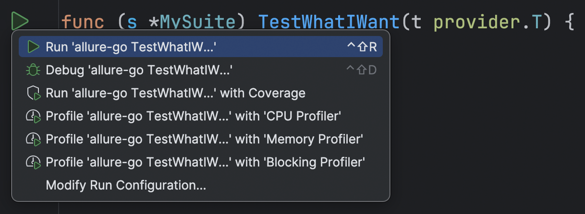

# allure-go-run-plugin

<!-- 
 -->

<!-- Plugin description -->

This GoLand plugin provides a convenient way to run test written using [ozontech/allure-go](https://github.com/ozontech/allure-go) framework directly from your IDE.

<!-- Plugin description end -->

## Installation

- Manually:

  Download the [latest release](https://github.com/shuryak/allure-go-run-plugin/releases/latest) and install it manually using
  <kbd>Settings/Preferences</kbd> > <kbd>Plugins</kbd> > <kbd>⚙️</kbd> > <kbd>Install plugin from disk...</kbd>.
